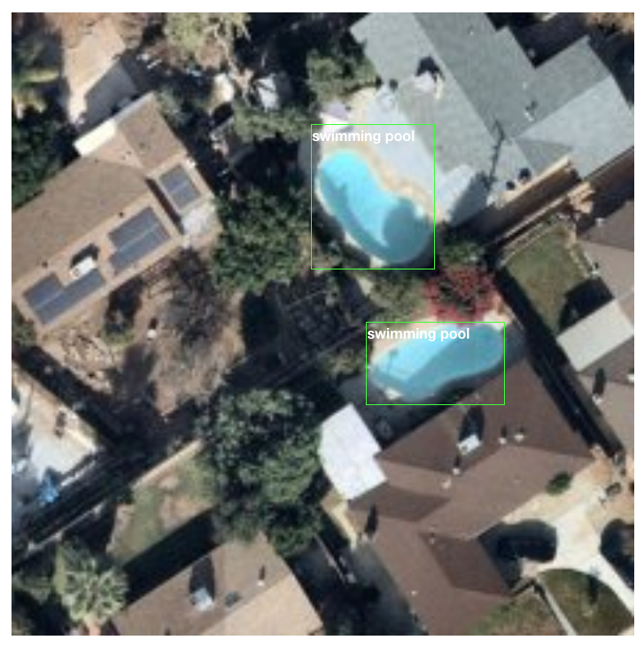
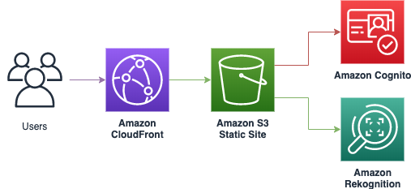
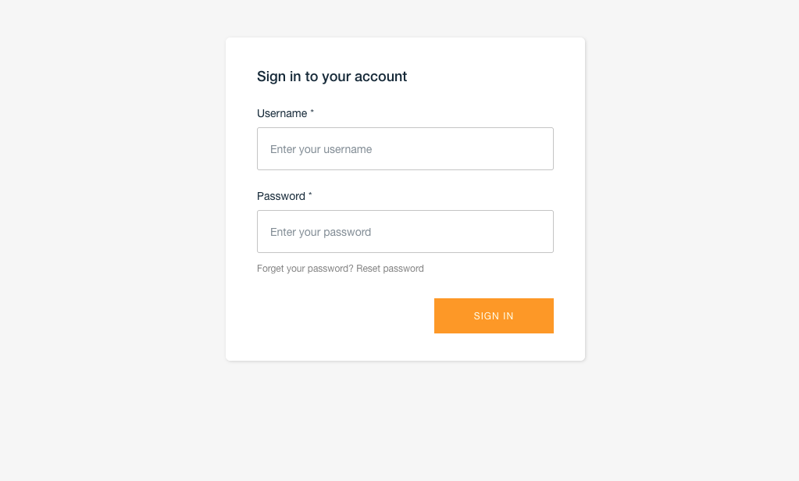
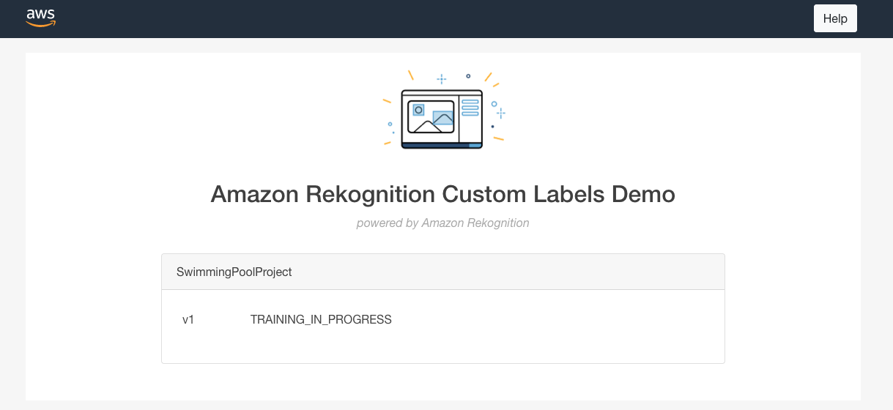
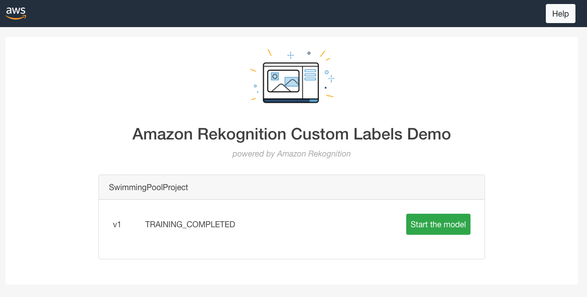
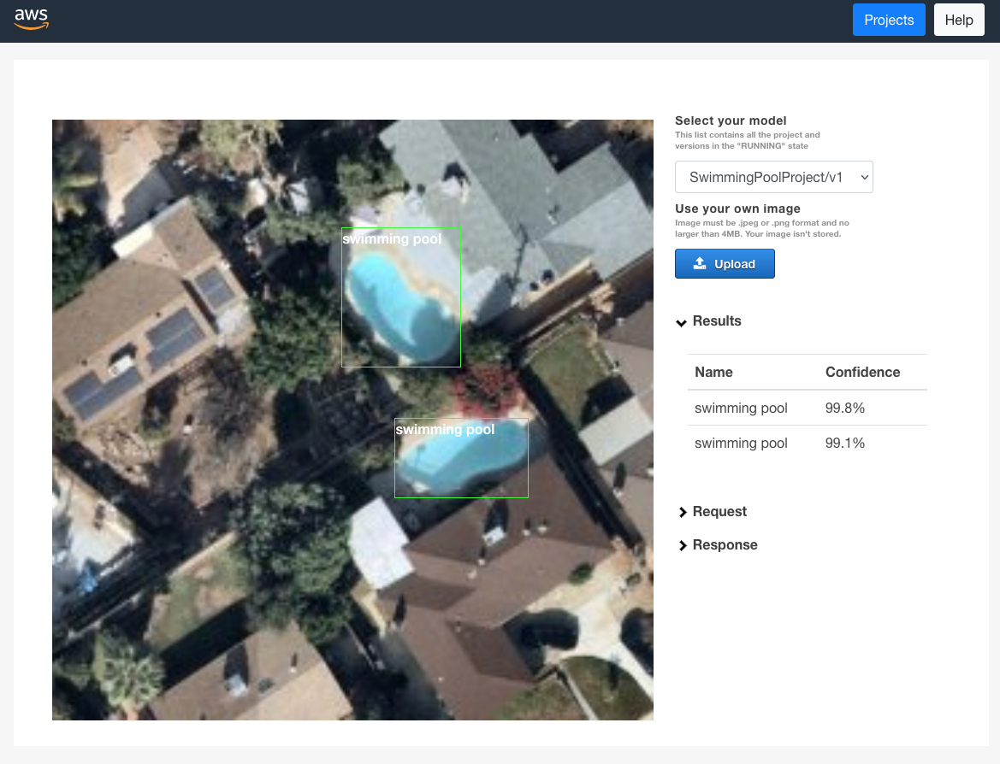

# SwimmingPool-Rekognition-Demo
This demo shows how to use Amazon Rekognition Custom Labels to detect swimming pools in satellite images.

Amazon Rekognition Custom Labels is a feature of Amazon Rekognition that enables customers to build their own specialized machine learning (ML) based image analysis capabilities to detect unique objects and scenes integral to their specific use case.

Instead of having to train a model from scratch, which requires specialized machine learning expertise and millions of high-quality labeled images, customers can use Amazon Rekognition Custom Labels to achieve state-of-the-art performance for their unique image analysis needs.

 The demo is composed of:
    
- approximately 200 images labelled using Amazon Ground Truth. Approximately 100 images are containing a swimming pool. The labelization result is stored in a manifest file.
- a CloudFormation template to deploy a Rekognition Custom Labels project
- a CloudFormation template to deploy a web site in order to control Rekognition Custom Labels models
- a Makefile to build the infrastructure, copy the images and launch the Cloudformation templates
- a set of 6 images to demonstrate the model's capabilities.

The demo deploys a web site to easily control the created models and to visually demonstrate the results. The web site has the following architecture:

*Note 1: the Rekognition Custom Labels website has been taken from the following AWS Sample: https://github.com/aws-samples/amazon-rekognition-custom-labels-demo* 

*Note 2: the satellite images is a subset from this Kaggle dataset under the GNU General Public License and labelled by myself.https://www.kaggle.com/kbhartiya83/swimming-pool-and-car-detection/activity* 

# How to deploy the demonstration

### Prerequisites

To deploy the sample application, you will require an AWS account. If you don’t already have an AWS account, create one at https://aws.amazon.com by following the on-screen instructions. Your access to the AWS account must have the correct IAM permissions. You will also need the aws cli installed and configured on your computer.

### Deployment

Clone this repository on your environment using the git clone command.

Execute the Makefile by copying the following command, replacing YOURBUCKETNAME by a non existing bucket name and YOUREMAIL by your email address.

``make all s3artifact=YOURBUCKETNAME email=YOUREMAIL``

*Note: YOUREMAIL shall be a valid email address. It will be used to send you a temporary password to connect to the deployed website*

Once all the commands are executed, your project should be fully deployed. However, the Rekognition project's model will be in training mode. The training should not take more than 2 hours.

# How to use the demonstration

To get the url of the deployed web site, you can open your AWS console and go to the Cloudformation section. A new stack called "websiteRekognition" shall be present. Open the stack and click on the url in the output section.

You should arrive to the following screen:

Login with the email provided in the Makefile parameter and with the temporary password received by email.

Once logged in, you shall have the following screen:

After maximum 2 hours, the model should be trained and you shall have the following screen (after refreshing the page):

Click on Start model and enter 1 in the inference unit section. Once the model is started, click on the upload button and select an image from the demoImages folder. The algorithm should analyse the image and detect the swimming pools.

**IMPORTANT NOTE: in order to avoid unecessary cost, the Rekognition Custom Labels model shall be stopped after usage. This can be done easily via the web site.**